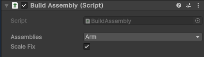

# Custom Models

Additional to the Part Library, Builder Beta features a dedicated system for external Models.

### Build Assembly
* `Build Assembly` is a *dynamic* part library.
* To add your part to the `dropdown` place the model in `Resouces/Parts/Assembly`
* The model can be .dae (collada in onshape), .fbx, or a .prefab

### Usage
* Parts will autopopulate the `dropdown` and simply selecting them will spawn them
* `Scale Fix` sometimes models direct from cad are scaled down, enabling this setting will upscale the model to accurate sizing.

### prefab support
* `Build Assembly` can spawn prefab files as well.
* This allows a model to not only have a model, but `colliders` and `mechanisms` inside it

### Sharing
* you can follow the steps in [SharingRobots](SharingRobots.md) except only select your models and the parts in `Resouces/Parts/Assembly`

# [Further Reading](FurtherReading.md)
