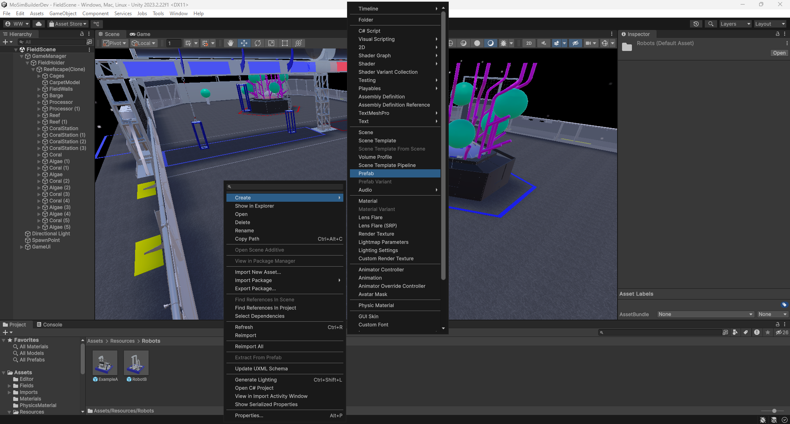
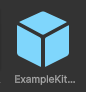
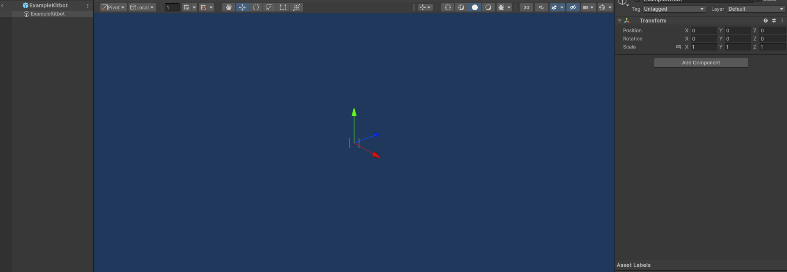
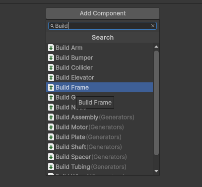
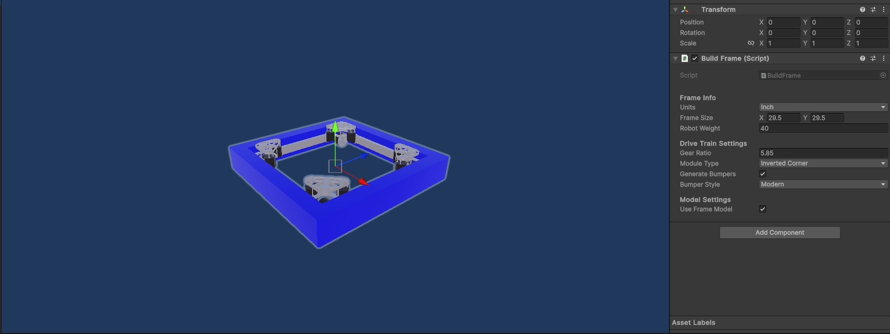
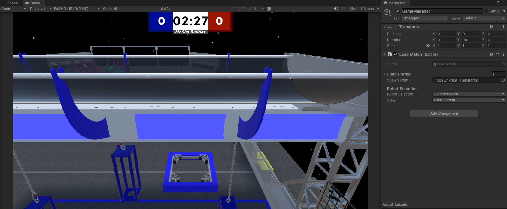

# Creating Your First Robot

## Adding a robot

* In the `Resources -> Robots` folder, right-click the `Project View`
* Select `Create -> Prefab`. Prefabs are separate objects, which in this case, is the robot
  

* Name the prefab however you'd like. This is your robot's name
* This should create a new prefab object with a cube icon as shown below
  
 

## Setting up the DriveTrain

* Double-click the prefab you just created to open it up the editor (NOTE: this will replace the field editor on the
  screen, but don't worry, you can click the back arrow on the top left of the `Hierarchy` to go back)
* The editor is how robots are altered
* It is recommended to disable auto save which is found in the top right of the `Scene View` to avoid any major issues
  and reduce load time (Don't forget to save frequently though)
* To start creating the actual robot, select the object at the top of the `Hierarchy` to open the `Inspector` window
  
  

* Next click `Add Component` to open the component menu. Search for `Build` to find a plethora of build scripts. For
  now, you'll just need to select `BuildFrame`
  
 
  
* You may be a ways away from the frame, simply double-click the new entry in the `Heiarchy` driveTrain to zoom in
* Now you can see the frame you just made
  
  

* The `Inspector` window will have now also changed featuring the `Build Frame` script and some parameters for
  customization
* For this tutorial robot, we'll just keep the default values
* As the parameters are updated in the script, the frame model should update in accordance to the new parameters
* You can already return to the `Field Scene` (remembering to save) and select your robot from the `GameManager` drop down
* Once done you can click play and drive your robot around.

  

## Basic Game Piece Manipulation

* Right-click the base object in the `Hierarchy` (Named with your robot name), and select `Create Empty` to create a
  component
* Name the component whatever you'd like (`Intake` in the example below)
  
  
* 
  <h3>Intake</h3>
* To create the intake collider, you'll need to use the `BuildNode` script
* Select the object in the `Hierarchy` and click `Add Component`, just like what was done in the Drive Train creation
* This time, instead of selecting the `BuildFrame` script, select the `BuildNode` script
* This should add the `BuildNode` script to the `Inspector` window for that object
* //TODO: Add steps for creating an intake node (params, position intake and collider)
  
  
* 
  <h3>Stow</h3>
* A stow object is the end destination of the intake process. It is recommended to create a separate object for the stow node, but it can also be placed inside the intake object.
* Once again create a new object, select it and click add the `BuildNode` script. This time however, under (//TODO: find term) select `Stow` instead of `Intake`
* //TODO: Add steps for creating a stow node (params, positioning, set up transfer from intake)
  

  <h3>Outtake</h3>
* All the same steps should be done to create an outtake object and add the outtake node to it
* //TODO: Add steps for creating outtake (params, transfer)
  
  

And now you're done! Click the back arrow on the top left of the `Hierarchy` (Save first!) to return to the `Field Scene` and start playing with your robot.

## Playing with the robot.

* Select `GameManager` in the `Hierarchy` and select your robot from the robot selector.
* Also in `GameManager` open the `Fields` dropdown and ensure that your desired field is on the top of the list (by dragging it to the top)
* Optionally select the camera perspective as well
* When you're ready, click the `Play` button on top of the `Scene View` to start playing!

//TODO: Only edited above this line
## Iterating the Design

* The next step is to play with the amp
* To do this we are going to create a new object on the robot named OutakeAmp. we will give it the same position angle
  and size as the Outake object, delay of 0 and outake direction of forward. Set the Outake Speed to 4.4 and back spin
  to 4.4
* Now back on stow we are going to add a new endpoint by clicking the plus below the endpoint list. drag outake amp to
  the new endpoint and the transfer button to Y
* Return and click play and see how it works
  

## Introduction To Heirarchy usage and climbers

* in order to climb we need to understand how the heirarchy works. The heirarchy has two types of object references.
  Parents, and Childs, a parent is an object that has objects inside its "folder". A child, is the objects inside the
  folder.
* For instance in the photo below. ArmSec1 is a Child of Arm. ArmSec1 is a parent of ClimbElevator(1), and Stationary is
  a child of ClimbElevator(1).

* So why is this important. well, children of an object will follow their parent. so to get a set of colliders to follow
  our climb elevator we need to make sure to child it to the correct object on the elevator.
* So create an empty object and add an elevator generator.
* This is by far the most complex generator but is mostly self explanatory. You can set the weight of the non moving
  part of the elevator, and the weight of the moving part. The only od thing is that if you check stow top, you in
  essance will visually lose a stage
* Returning to our situation we will set the Height to 15 num of stages to one, and width to 3 so that we can align the
  hook. Feel free to drop it lower to treat it like a telescopic tube it is not easy to line up child parts if you do
  though.
* set the stationary weight to 5 and the stage weight to 1.
* set the setpoint to 15.
* Now drag it to one side of the shooter/stow body
* Now, open the climb elevator by clicking the arrow next to it. then stationary > Stage 1. Create an empty object by
  right clicking stage 1 and name it hook
  
* Next add a hook generator to the elevator.
* Set the width to 1, stem Height to 17, bride length to 3 and hook Height to 1.
* Then align it with the cross bridge on the elevator, this is the "stage" it is aligned to middle in the editor for
  ease of spotting.
  
* return to the field scene and test.
* The robot likley did not pull of the ground. this is easy to fix, simply click the climbElevator Object the Ctrl C
  Ctrl V (copy and paste) the game object and drag to the other side. you now have two identical climbers.
  

# [Next step](https://github.com/masonmm3/MoSimBuilder/blob/Stable/Documentation/SecondRobot.md)

