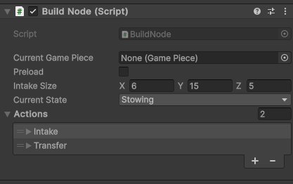
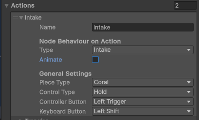
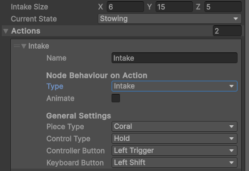
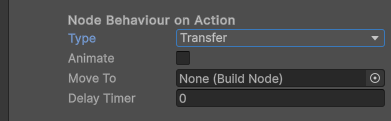
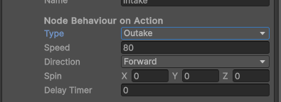

# Game Pieces

## Builder Beta uses a setpoint esq system for game piece interactions

* `Build Node` is the home for all of builders functionality
  
  

Build Node operates on a similar system to the [Setpoint System](Setpoints.md) used by mechanisms.

### Basic Settings

The system makes heavy usage of `hidden settings` which are new to the beta. This allows the information you need and only the information needed to be displayed.
By default there will be a `CurrentPiece` `preload` and `currentState`. `CurrentPiece` and `CurrentState` are both debug and should be left as is. When Preload is checked a new line for what piece to spawn is added

### Actions

`Actions` are the core of the game piece system. These can be added by opening the dropdown and selecting the + at the bottom

  
  
`Actions` are made up of several sub peices
* `Name`
* `Type`
* `Animate`
* `PieceType`
* `ControllerButton`
* `KeyboardButton`

Other things will apear and disapear based on these core settings

### Name
This is completely optional however it does make organization of the dropdown significantly easier as it will display when closed instead of Element x

### Type
`Type` determines the actual behaviour that `Action` caries out. There are currently three `Types`. `Intake` `Transfer` and `Outake`
* `Intake`
    * `Animate` allows you to animate the motion from the point of contact to the `BuildNodes` center. The specifics are explained in a later section
    * Enables several new options, `Animate` and `Size` as well as spawning a new box collider child. You can use the `Size` box to resize the collider and manualy move the child.
    * Intake is what allows indexing a piece into a robot.
 
        
      
* `Transfer`
    * Enables several new options, `Animate` `MoveTo` and `Delay`
    * `Animate` allows you to animate the motion between two `nodes`. The specifics are explained in a later section
    * `MoveTo` is for transfering the current piece to another `Build Node`. you assign this by dragging the object with the destination `node` into this slot
    * `DelayTimer` this allows a delay period be met before initiating the transfer

*`Outake`
  * Enables several new options, `Speed`, `Direction`, `spin`, and `DelayTimer`
  * `speed` is the velocity of the release
  * `direction` is the direction, it can be Up, Left, and Forward, the opposites are achieved with `negative` speed.
  * `spin` is the amount of angular velocity on each axis you want to use.
  * `Delay Timer` requires a certian period be met before outaking

    

### Piece Type
  * This controls what piece that action interacts with
  * NOTE that a single node can have actions interacting with any game piece type. `NODES` do not possess a piece type, only a single spot for a piece REGARDLESS its type.

### Controls
  * There are three `Control Types`
      * `tap` which attempts to perform the action the frame it is pressed and only that frame
      * `hold` which attempts to perform the action the entire time it is held
      * `alwaysPeform` will always attempt to perform that action
  * Controls are `per input device` which means you have access to all NON HARDCODED buttons for each input style.
      * NOTE: Controller is Xbox layout
   
### Animations
  * enabling animations for any setting it is supported, adds two new fields, `speed` and `angular speed`
  * `speed` is how fast the piece moves linearly
  * `angular speed` is the angular velocity for that animation
  * animations are intended as an extra setting and thus not completely stable in all situations
  * Enabling Animations on an intake makes it `breakable` so if the distance increases instead of decreases between two ticks it is returned to the world

# [Further Reading](FurtherReading.md)
